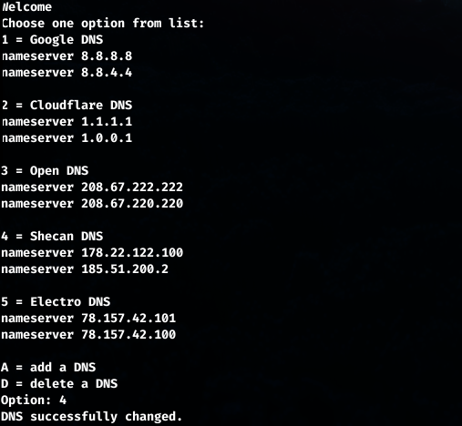

# Terminal DNS changer for Linux


tested on debian12

This program requires Python3

### Install
```
cd terminal-dns-changer-1.0/ 
sudo ./install.sh
```
### Uninstall
```
sudo ./uninstall.sh
```

run `dns-changer` on your terminal

Installation path:`/opt/My-DNS-APP` and `/usr/local/bin/dns`